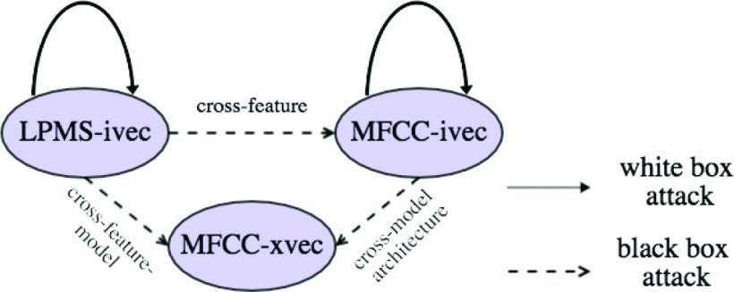

# 读论文——Adversarial Attacks on GMM I-Vector Based Speaker Verification Systems

## 简介

这是一篇2020年发布在ICASSP上的文章，这篇论文使用FGSM实现了针对于基于GMM-ivector的说话人验证系统的对抗性样本攻击，并且在Github上提供了以下三种语音模型的Kaldi [实现代码](https://github.com/lixucuhk/adversarial-attack-on-GMM-i-vector-based-speaker-verification-systems)（使用了Voxceleb1数据集），适合上手学习。

- i-vector-lpms
- i-vector-mfcc
- x-vector-mfcc

三种模型之间的关系如图，每个箭头代表了一种攻击设置，箭头方向表示使用尾部的模型生成的对抗性样本去攻击头部所指的模型。

## 语音识别系统

该项目实现了GMM i-vector 和x-vector两种系统。两种系统都有两个部分：用于话语级说话人嵌入提取的前端和用于说话人相似性评分的后端。所有实验均采用``PLDA``后端。

## 对抗性样本生成

样本生成层级：升学特征级，即MFCC或LPMS。通过将生成的对抗性特征转换成音频，来进行攻击（是样本转化成音频还是扰动转化成音频？）

黑盒实现方式：从源模型（LPMS-ivector和MFCC-ivector）中制作对抗性样本，直接迁移攻击

