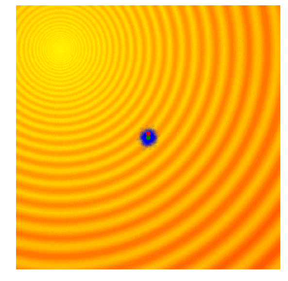

> 进化策略是一种模仿生物进化原理提出的参数优化方法。生物的进化总是朝着适于生存的方向发展，而把不适者淘汰。进化策略的核心就是在原样本的基础上生成一堆符合某种分布的随机噪声，生成一堆新样本，再计算出这堆新样本的得分（或者说损失），得分高的保留，得分差的淘汰，经过迭代最后能够找到局部最优解。这样就不用对损失函数求梯度，但也能得到梯度下降的大致方向。
>
> 进化策略类的算法分为**遗传算法(GA)**、**协方差矩阵自适应演化策略(CMA-ES)**、**自然进化策略(NES)**、**OpenAI的进化策略**等。本文结合自己的理解对以上集中主流的进化策略算法所简要的探讨，主要参考["论智"的文章](https://zhuanlan.zhihu.com/p/31456028)。

进化策略的思想的其实很好理解，简单暴力，比梯度下降算法更直观，直观到不需要解释，看图就行了。但是，不得不说这个算法让我感到恍然大悟，从梯度下降的固定框架中解放出来。

# 算法原理

## 遗传算法

遗传算法是其中历史比较悠久的黑盒优化算法之一，具有很多迭代版本。追本溯源，探讨最根本也是简单的一种。

只保留当前这一代中一定比例，如前10%的最优解，然后舍去剩下的90%。在下一代，算法从上一代遗留下来的解中随机选择一对父本，并重组它们的参数形成一个新个体。这个从父本抽调参数的交叉重组过程类似抛硬币，是完全随机的（其实需要考虑近亲繁殖因素，但本文不涉及）。在我们的玩具问题中，这个新解继承父本x、y参数的概率各占50%，因此带有固定标准差σ的高斯噪声也会随着重组过程进入每个新的解。